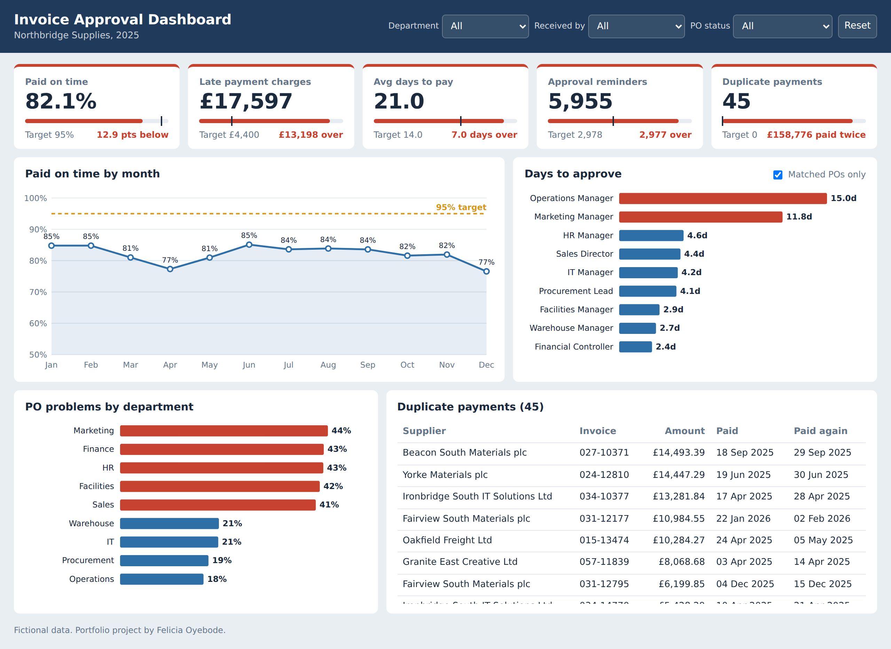

# Invoice Approval Process Review: Northbridge Supplies

**An end-to-end business analysis case study, from stakeholder interviews to a business case and KPI dashboard.**

**Skills:** Stakeholder analysis · Elicitation interviews · BPMN process mapping · Python (pandas) · Root cause analysis · Options appraisal · User stories and acceptance criteria · MoSCoW · Traceability · UAT planning · Business case · Power BI / dashboard design

### Key outcomes

- Showed that three root causes explain most of the gap between **82.1%** of invoices paid on time and the **95%** target
- Found **45 duplicate payments worth £158,776**, confirming a concern raised by the auditors
- Recommended an option that pays back in about **11 months**, using software the business already owned

*Based on 5,045 simulated supplier invoices.*

[**Open the interactive dashboard**](https://lolabode.github.io/northbridge-dashboard.html)

---

## 1. The brief

Northbridge Supplies is a UK wholesaler with about 250 staff. Its Finance Director asked for a review of how supplier invoices get approved, because:

- suppliers were complaining about late payment, and two had threatened to stop deliveries
- some suppliers had started charging late-payment fees and interest
- the accounts payable (AP) team was spending a lot of time chasing approvals
- the external auditors had raised concerns about payment controls

The targets were to pay at least 95% of invoices on time, cut late-payment charges by 75%, pay a third faster, halve approval reminders, and prevent duplicate payments.

## 2. How I approached it

I followed a standard business analysis approach in six phases:

| Phase | What I did | Output |
|---|---|---|
| 1. Plan | Mapped stakeholders, agreed who does what, and set the process boundaries | Stakeholder map, RACI, SIPOC |
| 2. Understand the current process | Interviewed ten stakeholders, from the Finance Director to a supplier, then mapped the process | Interview notes, as-is process map |
| 3. Analyse | Tested what stakeholders told me against a year of invoice data | Python notebook |
| 4. Design | Compared four options with input from IT, and mapped the improved process | Options comparison, to-be process map |
| 5. Define requirements | Wrote user stories with acceptance criteria and priorities | Requirements spreadsheet |
| 6. Make the case | Costed the recommendation, planned testing and built a dashboard to track it | Business case, UAT plan, dashboard |

## 3. What stakeholders told me

I interviewed ten people: the Finance Director, the AP Team Lead and an AP clerk, two budget holders (Operations and Marketing), the Procurement Lead, the Financial Controller, a warehouse supervisor, the IT Business Systems Manager, and a credit controller at one of the suppliers. I also reviewed the auditors' management letter.

The same three problems came up again and again:

- **Invoices arrive without a PO.** Urgent jobs are phoned through, agencies on retainers never get a PO, and suppliers say they'd quote one if anyone asked.
- **Approvers can't approve with confidence.** Requests get lost in email, and approvers can't see the PO or whether goods arrived. Delivery notes exist, but only on paper in the warehouse.
- **Nothing stops duplicate payments.** Suppliers resend invoices when chasing, and the system only shows a warning that's easy to click past.

Hearing different sides mattered. AP saw managers as slow; the managers explained *why*: they don't have the information they need.

## 4. The current process

The as-is map shows how invoices really move today, including the workarounds. Red notes mark the pain points raised in interviews.

## 5. What the data showed

I used Python to test each stakeholder claim against all 5,045 invoices from 2025.

| What stakeholders said | Did the data agree? | Evidence |
|---|---|---|
| About 1 in 4 invoices has a PO problem | Yes, slightly more | 28% of invoices |
| Some approvers are much slower | Yes | Operations Manager 15 days, most others under 5 |
| Month-end causes a backlog | Yes | 6.7 days to log invoices vs 1.4 |
| Posted invoices are slower | Yes, but a small effect | 24 days to pay vs about 20 |
| About a day a week is spent chasing | It's more than that | About 2,168 hours a year (around £39,000) |
| Some invoices may have been paid twice | Yes | 45 invoices, £158,776 |

One finding surprised me. The Operations department actually had one of the *lowest* rates of PO problems (17.6%), even though the Operations Manager said his team sometimes skips them. Operations' real issue was approval speed, not POs. Checking claims against data is exactly where this kind of thing comes out.

## 6. Root causes

1. **PO problems.** 28% of invoices, 57% of late payments, and 9 in 10 queries.
2. **Slow approvals from two budget holders,** mainly because approvals arrive by email without the information needed.
3. **No duplicate payment check.** The system only warns, and the warning is easy to click past.

## 7. Options and recommendation

| Option | Fixes PO problems | Fixes slow approvals | Fixes duplicates | Cost |
|---|---|---|---|---|
| 0. Do nothing | No | No | No | £0 |
| 1. Quick process fixes only | Yes | No | Yes | About £0 |
| **2. Quick fixes plus the approval workflow module** | **Yes** | **Yes** | **Yes** | **£25k + £4k a year** |
| 3. New accounts payable system | Yes | Yes | Yes | Much higher |

**I recommended Option 2.** The company already paid for an approval workflow module but had never switched it on. A pilot in 2023 failed because nobody owned it and the approval list was out of date, not because of the technology. So the recommendation includes a named Finance owner and a cleaned-up approval list, not just the software.

It would be delivered in three phases:

- **Phase A, weeks 1 to 2:** block duplicate payments, introduce "no PO, no pay" and a quick emergency PO for urgent jobs.
- **Phase B, weeks 3 to 12:** switch on the workflow module, with mobile approval, automatic reminders and backup approvers.
- **Phase C, later:** warehouse staff record deliveries on a tablet, so approvers can see goods have arrived.

## 8. The improved process

Green notes show what changes. A new "Finance system" lane shows the work that moves from people to the system.

## 9. Requirements and testing

- **14 user stories,** each with Given / When / Then acceptance criteria, a MoSCoW priority, and a link back to the root cause it fixes. Two are marked "Won't have" so it's clear what's out of scope.
- **30 UAT test cases** built from the acceptance criteria. They include boundary tests (an invoice of exactly £10,000) and tests that use real duplicates from the data.

## 10. Business case

| | Year 1 | Over 3 years |
|---|---|---|
| Total cost | £29,000 | £37,000 |
| Total benefit | £32,600 | £97,800 |
| **Net benefit** | **£3,600** | **£60,800** |

The £158,776 of duplicate payments is kept out of these figures on purpose. Blocking duplicates is free and happens in Phase A, so it shouldn't be used to justify buying anything. The benefit estimates are cautious and the assumptions are listed in the business case.

## 11. What I'd do differently

- **Speak to more suppliers.** I spoke to one supplier. A short survey of the top 20 would show how widespread the problems are from their side.
- **Check the costs.** The £25,000 is an estimate from IT. A real business case would need a quote from the software partner.
- **Validate the maps.** I'd walk the AP Team Lead and Operations Manager through the process maps to confirm they're accurate before designing changes.

---

## Files

| File | What it is |
|---|---|
| [project_brief.md](project_brief.md) | The brief from the Finance Director |
| [northbridge_invoices_2025.csv](northbridge_invoices_2025.csv) | 5,045 simulated invoices |
| [northbridge_interview_notes.pdf](northbridge_interview_notes.pdf) | Notes from all ten stakeholder interviews |
| [northbridge_data_analysis.ipynb](northbridge_data_analysis.ipynb) | Python analysis and findings |
| [northbridge_as_is_bpmn.png](northbridge_as_is_bpmn.png) / [.drawio](northbridge_as_is_bpmn.drawio) | Current process map |
| [northbridge_to_be_bpmn.png](northbridge_to_be_bpmn.png) / [.drawio](northbridge_to_be_bpmn.drawio) | Improved process map |
| [northbridge_requirements.xlsx](northbridge_requirements.xlsx) | User stories, priorities and traceability |
| [northbridge_uat_test_plan.xlsx](northbridge_uat_test_plan.xlsx) | UAT test cases |
| [northbridge_business_case.pdf](northbridge_business_case.pdf) | Business case for the Finance Director |
| [northbridge-dashboard.html](northbridge-dashboard.html) | Interactive dashboard (download and open in a browser) |

## About this project

This is a self-directed portfolio project, built to practise the full business analysis cycle. The company, people and data are fictional. AI tools were used to help generate the simulated data, role-play stakeholder interviews and draft parts of the documents. The analysis, decisions and recommendations are my own.

**Felicia Oyebode** · [LinkedIn](https://www.linkedin.com/in/felicia-oyebode-587353197/) · [Portfolio](https://lolabode.github.io)
